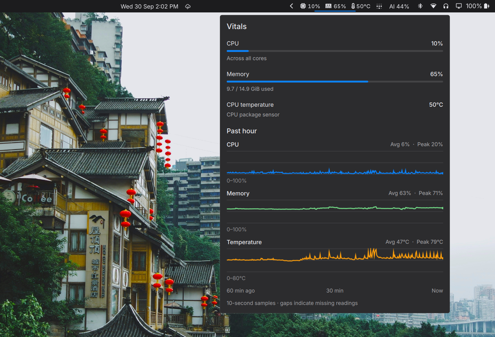
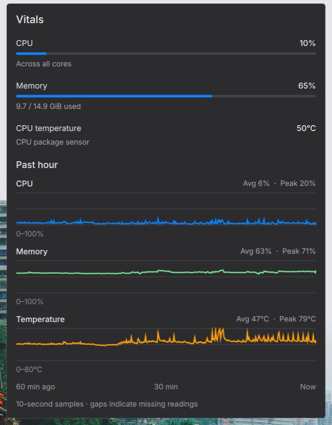
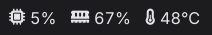

# Omarchy Vitals

CPU, memory and temperature at a glance. Click the bar widget to open live
readings and the past hour of activity.



*Captured on an Omarchy laptop with real readings and a full hour of history.*

<details>
<summary>View the history panel up close</summary>



</details>

## What you get



From left to right: **CPU usage**, **RAM usage**, **CPU temperature**.
Hover for labels; click for details.

- Live readings every two seconds, with compact icons and consistent spacing.
- A fixed bar footprint, so changing values do not move neighbouring widgets.
  Longer readings shrink slightly to fit.
- One-hour charts for CPU, memory and temperature, with averages and sampled peaks.
- A native popup that follows your Omarchy colors, fonts, corners and transparency.
  Click outside or press Escape to close it.
- Background collection while the popup is closed. Readings stay on your machine;
  the collector makes no network requests.

If your theme uses frosted popups, Hyprland layer blur must also be configured.

## Requirements

- Omarchy with its Quickshell shell and the `qs.Ui.KeyboardPanel` and
  `qs.Ui.OpticalGlyph` components. Tested on the Omarchy v4 desktop installed in
  September 2026. Waybar installations are unsupported, and the shell APIs can
  change between releases.
- Linux, Python 3.10+, systemd user services and an active graphical session.
- A Nerd Font installed for the bar icons. You can use another text font with
  Nerd Font fallback.
- Read access to `/proc/stat`, `/proc/meminfo` and optional CPU temperature
  sensors under `/sys`.

No root access or pip dependencies are needed.

## Install

```sh
git clone https://github.com/lucasscariot/omarchy-vitals.git
cd omarchy-vitals
python3 install.py
```

The installer backs up the affected configuration, installs the user service,
adds Vitals to the right side of your bar, starts the collector and restarts the
shell. An existing Vitals entry keeps its position. Settings for that entry are
replaced by the native plugin entry; other widgets are preserved.

The first live reading takes about two seconds. History starts collecting at
installation and fills while the collector runs.

### Install with Omarchy's plugin command

```sh
omarchy plugin add https://github.com/lucasscariot/omarchy-vitals.git
python3 ~/.config/omarchy/plugins/lucas.resource-usage/install.py
```

The plugin command clones Vitals. Run `install.py` afterward to set up the
collector service and enable the widget. This manual setup is required for live
readings and history.

### Update

Run from your cloned repository:

```sh
git pull --ff-only
python3 install.py
```

### Install without starting services

Use `python3 install.py --no-start` to write the files without starting services
or restarting the shell. When you are ready:

```sh
systemctl --user daemon-reload
systemctl --user enable --now omarchy-resource-usage.service
omarchy restart shell
```

The plugin is installed at
`$XDG_CONFIG_HOME/omarchy/plugins/lucas.resource-usage` (default `~/.config`).
The directory and manifest ID must remain `lucas.resource-usage`. That internal
ID preserves existing installations; the project and display name are Omarchy Vitals.

## Reading the numbers

| Reading | What it measures |
| --- | --- |
| CPU | Usage across all logical CPUs, calculated from deltas in `/proc/stat`. |
| RAM | Total minus available memory from `/proc/meminfo`, excluding reclaimable cache. The popup also shows used and total GiB. |
| Temperature | A supported CPU package sensor, in Celsius. A dash (`—`) means no supported reading is available. |

Temperature prefers AMD `k10temp`/`zenpower` package readings or Intel `coretemp`
package readings, falling back to core readings and recognized CPU/SoC thermal
zones. Multiple package sensors use the hottest reading. GPU and disk
temperatures are not substituted. CPU and RAM still work when temperature is
unavailable.

History uses ten-second samples, saved every 30 seconds and on clean shutdown.
Each CPU history point reflects a two-second measurement, so short spikes can
be missed. Average and peak refer to the available samples, not a continuous
measurement of the entire hour.

CPU and RAM charts use a 0–100% scale. Temperature uses a labeled dynamic scale.
Sleep and shutdown leave gaps; missing history is not filled in. Only the most
recent hour is loaded and retained. An abrupt shutdown can lose up to 30 seconds
of unsaved history.

| File | Location |
| --- | --- |
| Live readings | `$XDG_RUNTIME_DIR/omarchy-resource-usage.json` |
| Saved history | `$XDG_STATE_HOME/omarchy/resource-usage/history.json` (default `~/.local/state`) |

## Troubleshooting

Check the collector and its recent logs:

```sh
systemctl --user status omarchy-resource-usage.service
journalctl --user -u omarchy-resource-usage.service -n 30
```

Open the panel directly:

```sh
omarchy-shell lucas.resource-usage open
```

After editing plugin code, run `omarchy restart shell` if the bar still shows
the previous version. A missing temperature reading alone does not prevent CPU,
RAM or history collection.

## Uninstall

Run from the repository or installed plugin directory:

```sh
python3 install.py --uninstall
```

This removes the bar entry and disables/removes the service. It keeps the plugin
source, configuration backups and history. You can remove those directories
afterward if desired.

## Development

```sh
python3 -m unittest discover -s tests -v
```

The collector uses the Python standard library. Tests use synthetic sensor
directories and temporary installation roots; they do not change desktop
settings or start services. Visual validation requires an Omarchy session.

Licensed under the [MIT license](LICENSE).
